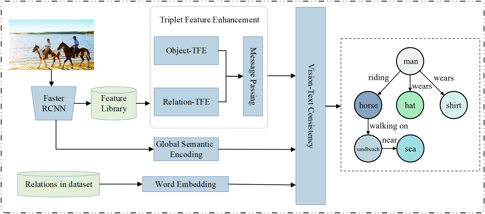

# SGFE

Official repository for:

**SGFE: Semantically Guided Feature Enhancement for Unbiased Scene Graph Generation**

## Overview

SGFE is a semantically guided feature enhancement framework for unbiased
scene graph generation. It consists of three main components:

- Triplet Feature Enhancement (TFE)
- Global Semantic Encoding (GSE)
- Vision-Text Consistency Alignment (VTC)

## Code

🚧 **Code is coming soon.**

The source code, configurations, and evaluation scripts will be released soon.

## Citation

Citation information will be updated upon publication.
